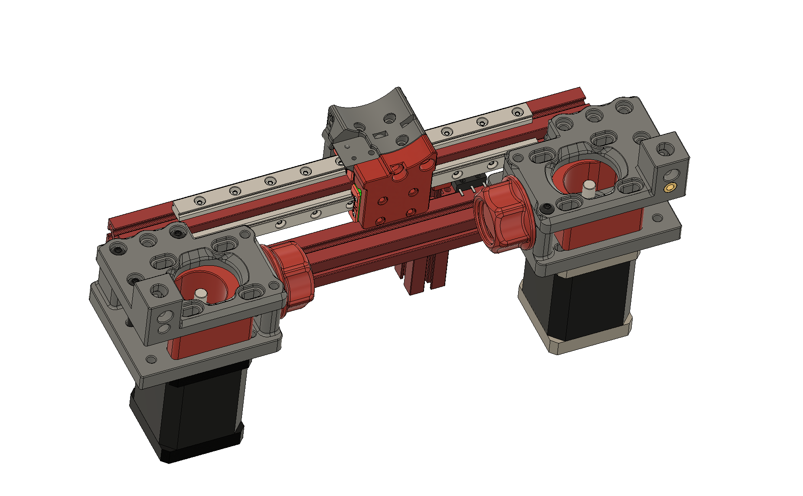
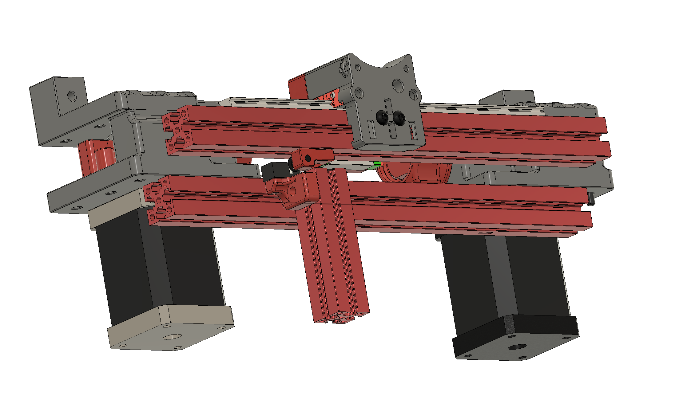

2nd X MGN7 rail for the mini AB.

A/B mounts are from my LGX mount design.

I have two Y endstop location versions, left and right, choose whatever you like.

You need to print new X carriage, backplate and A/B stepper mounts.

