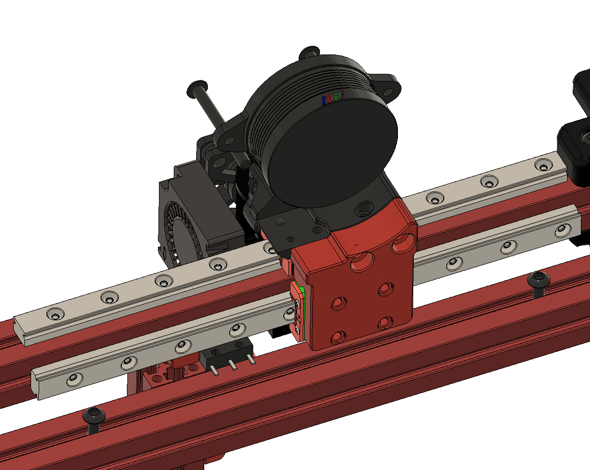

2nd X MGN7 rail for the mini AB.

A/B mounts are from my LGX mount design.

Y end stop need to relocated, for that I designed new Z end stop.

You need to print new X carriage, backplate and A/B stepper mounts.

