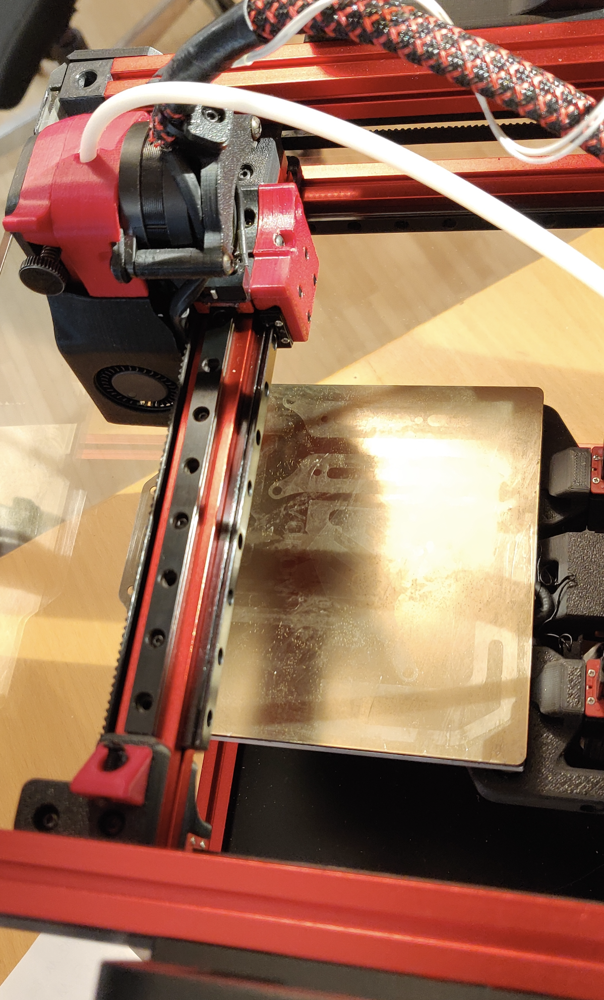
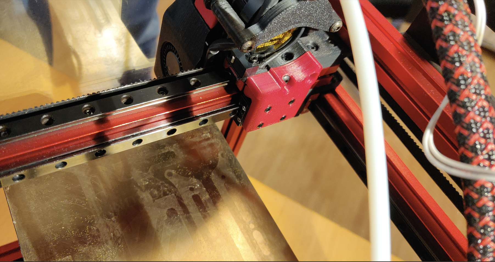

2nd X MGN7 rail for the mini AB.

A/B mounts are from my LGX mount design.

You need to print:
- X carriage
- Backplate
- both A/B motor frames 
- Y end stop mount

I have two Y endstop location versions, left and right, choose whatever you like, but right makes more sense for most.

To mount on the right side, same site as stock:
- Y Endstop Trigger R.stl
- Y_Endstop_Mount_R.stl

To mount on left (you need to flip the motor panel)
- Y Endstop trigger L.stl
- Y_Endstop_Mount_L.stl

