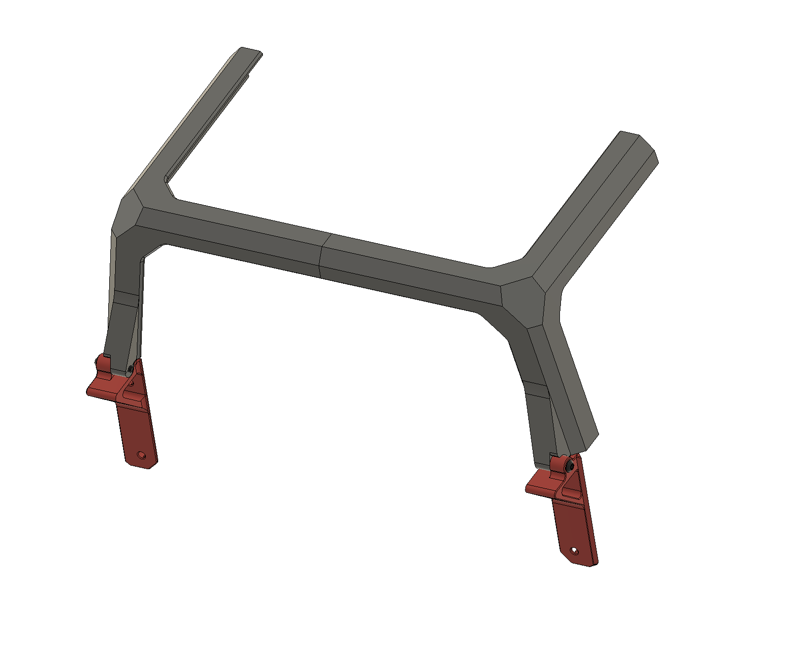

I'll be redesigning the bottom/top hinge to make it universal, the tophat integrated will stay the same, the 2nd version for retrofitting will change to fit the tophat integrated.
This way you can print just the tophat with hinge and no need to replace the bottom hinge.

The current version will stay in this reop.

Use M3x16 for the hinge

Replace front lower corrners with:
- 3mm Lower_Corner front right.stl
- 3mm Lower_Corner front left.stl
I'll add for 2 and 2.5mm panels later.

Bottom hinges no panel.stl if you dont use back panel. 

