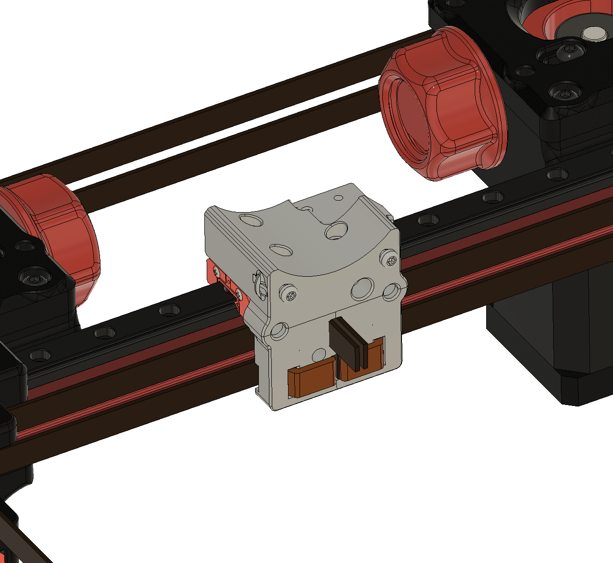

Voron V0.1 carriage with a mod for the belt end to hide it behind the carriage, you don't have to cut it flush, you can readjust the belt easy way, and you can keep them longer.

For V0.1, 100 cm belt is enough, you will have still about 2 cm sticking out of the carriage. In theory, you can go even 1-2 cm shorter if you have some leftover belt and need to replace it

